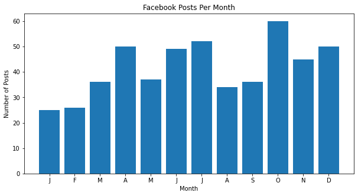
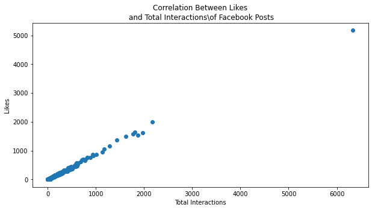

# Phase 1 Code Challenge Review


The topics covered will be:

  - [Interacting with Pandas dataframes](#dataframes)
  - [Visualization](#viz)
  - [Python Data Structures](#datastructures)
    


```python
# Import pandas, numpy, matplotlib, pickle, json
```


```python
#__SOLUTION__
import pandas as pd
import numpy as np
import matplotlib.pyplot as plt
import pickle
import json
```

<a id='dataframes'></a>
# DataFrames

To practice working with dataframes, we will use some Facebook data taken from the UCI Machine Learning repository.

Refer to this paper if you are interested in learning more. There is also a nice description of the features: http://www.math-evry.cnrs.fr/_media/members/aguilloux/enseignements/m1mint/moro2016.pdf


# Task 1

Read 'dataset_Facebook.csv' from data/Facebook_metrics into the notebook as a Pandas dataframe.


```python
# Your code here
facebook = None
```


```python
#__SOLUTION__
facebook = pd.read_csv('data/Facebook_metrics/dataset_Facebook.csv',delimiter=';')
```

# Task 2

### 2a: Count how many na's there are in each column
 


```python
# Your code here
```


```python
#__SOLUTION__
facebook.isna().sum()
```


    Page total likes                                                       0
    Type                                                                   0
    Category                                                               0
    Post Month                                                             0
    Post Weekday                                                           0
    Post Hour                                                              0
    Paid                                                                   1
    Lifetime Post Total Reach                                              0
    Lifetime Post Total Impressions                                        0
    Lifetime Engaged Users                                                 0
    Lifetime Post Consumers                                                0
    Lifetime Post Consumptions                                             0
    Lifetime Post Impressions by people who have liked your Page           0
    Lifetime Post reach by people who like your Page                       0
    Lifetime People who have liked your Page and engaged with your post    0
    comment                                                                0
    like                                                                   1
    share                                                                  4
    Total Interactions                                                     0
    dtype: int64


### 2b: Drop records that have na's in any column without altering the dataframe in memory
 


```python
# Your code here
```


```python
#__SOLUTION__
facebook.dropna()
```


<div>
<style scoped>
    .dataframe tbody tr th:only-of-type {
        vertical-align: middle;
    }

    .dataframe tbody tr th {
        vertical-align: top;
    }

    .dataframe thead th {
        text-align: right;
    }
</style>
<table border="1" class="dataframe">
  <thead>
    <tr style="text-align: right;">
      <th></th>
      <th>Page total likes</th>
      <th>Type</th>
      <th>Category</th>
      <th>Post Month</th>
      <th>Post Weekday</th>
      <th>Post Hour</th>
      <th>Paid</th>
      <th>Lifetime Post Total Reach</th>
      <th>Lifetime Post Total Impressions</th>
      <th>Lifetime Engaged Users</th>
      <th>Lifetime Post Consumers</th>
      <th>Lifetime Post Consumptions</th>
      <th>Lifetime Post Impressions by people who have liked your Page</th>
      <th>Lifetime Post reach by people who like your Page</th>
      <th>Lifetime People who have liked your Page and engaged with your post</th>
      <th>comment</th>
      <th>like</th>
      <th>share</th>
      <th>Total Interactions</th>
    </tr>
  </thead>
  <tbody>
    <tr>
      <th>0</th>
      <td>139441</td>
      <td>Photo</td>
      <td>2</td>
      <td>12</td>
      <td>4</td>
      <td>3</td>
      <td>0.0</td>
      <td>2752</td>
      <td>5091</td>
      <td>178</td>
      <td>109</td>
      <td>159</td>
      <td>3078</td>
      <td>1640</td>
      <td>119</td>
      <td>4</td>
      <td>79.0</td>
      <td>17.0</td>
      <td>100</td>
    </tr>
    <tr>
      <th>1</th>
      <td>139441</td>
      <td>Status</td>
      <td>2</td>
      <td>12</td>
      <td>3</td>
      <td>10</td>
      <td>0.0</td>
      <td>10460</td>
      <td>19057</td>
      <td>1457</td>
      <td>1361</td>
      <td>1674</td>
      <td>11710</td>
      <td>6112</td>
      <td>1108</td>
      <td>5</td>
      <td>130.0</td>
      <td>29.0</td>
      <td>164</td>
    </tr>
    <tr>
      <th>2</th>
      <td>139441</td>
      <td>Photo</td>
      <td>3</td>
      <td>12</td>
      <td>3</td>
      <td>3</td>
      <td>0.0</td>
      <td>2413</td>
      <td>4373</td>
      <td>177</td>
      <td>113</td>
      <td>154</td>
      <td>2812</td>
      <td>1503</td>
      <td>132</td>
      <td>0</td>
      <td>66.0</td>
      <td>14.0</td>
      <td>80</td>
    </tr>
    <tr>
      <th>3</th>
      <td>139441</td>
      <td>Photo</td>
      <td>2</td>
      <td>12</td>
      <td>2</td>
      <td>10</td>
      <td>1.0</td>
      <td>50128</td>
      <td>87991</td>
      <td>2211</td>
      <td>790</td>
      <td>1119</td>
      <td>61027</td>
      <td>32048</td>
      <td>1386</td>
      <td>58</td>
      <td>1572.0</td>
      <td>147.0</td>
      <td>1777</td>
    </tr>
    <tr>
      <th>4</th>
      <td>139441</td>
      <td>Photo</td>
      <td>2</td>
      <td>12</td>
      <td>2</td>
      <td>3</td>
      <td>0.0</td>
      <td>7244</td>
      <td>13594</td>
      <td>671</td>
      <td>410</td>
      <td>580</td>
      <td>6228</td>
      <td>3200</td>
      <td>396</td>
      <td>19</td>
      <td>325.0</td>
      <td>49.0</td>
      <td>393</td>
    </tr>
    <tr>
      <th>...</th>
      <td>...</td>
      <td>...</td>
      <td>...</td>
      <td>...</td>
      <td>...</td>
      <td>...</td>
      <td>...</td>
      <td>...</td>
      <td>...</td>
      <td>...</td>
      <td>...</td>
      <td>...</td>
      <td>...</td>
      <td>...</td>
      <td>...</td>
      <td>...</td>
      <td>...</td>
      <td>...</td>
      <td>...</td>
    </tr>
    <tr>
      <th>494</th>
      <td>85093</td>
      <td>Photo</td>
      <td>3</td>
      <td>1</td>
      <td>7</td>
      <td>10</td>
      <td>0.0</td>
      <td>5400</td>
      <td>9218</td>
      <td>810</td>
      <td>756</td>
      <td>1003</td>
      <td>5654</td>
      <td>3230</td>
      <td>422</td>
      <td>10</td>
      <td>125.0</td>
      <td>41.0</td>
      <td>176</td>
    </tr>
    <tr>
      <th>495</th>
      <td>85093</td>
      <td>Photo</td>
      <td>3</td>
      <td>1</td>
      <td>7</td>
      <td>2</td>
      <td>0.0</td>
      <td>4684</td>
      <td>7536</td>
      <td>733</td>
      <td>708</td>
      <td>985</td>
      <td>4750</td>
      <td>2876</td>
      <td>392</td>
      <td>5</td>
      <td>53.0</td>
      <td>26.0</td>
      <td>84</td>
    </tr>
    <tr>
      <th>496</th>
      <td>81370</td>
      <td>Photo</td>
      <td>2</td>
      <td>1</td>
      <td>5</td>
      <td>8</td>
      <td>0.0</td>
      <td>3480</td>
      <td>6229</td>
      <td>537</td>
      <td>508</td>
      <td>687</td>
      <td>3961</td>
      <td>2104</td>
      <td>301</td>
      <td>0</td>
      <td>53.0</td>
      <td>22.0</td>
      <td>75</td>
    </tr>
    <tr>
      <th>497</th>
      <td>81370</td>
      <td>Photo</td>
      <td>1</td>
      <td>1</td>
      <td>5</td>
      <td>2</td>
      <td>0.0</td>
      <td>3778</td>
      <td>7216</td>
      <td>625</td>
      <td>572</td>
      <td>795</td>
      <td>4742</td>
      <td>2388</td>
      <td>363</td>
      <td>4</td>
      <td>93.0</td>
      <td>18.0</td>
      <td>115</td>
    </tr>
    <tr>
      <th>498</th>
      <td>81370</td>
      <td>Photo</td>
      <td>3</td>
      <td>1</td>
      <td>4</td>
      <td>11</td>
      <td>0.0</td>
      <td>4156</td>
      <td>7564</td>
      <td>626</td>
      <td>574</td>
      <td>832</td>
      <td>4534</td>
      <td>2452</td>
      <td>370</td>
      <td>7</td>
      <td>91.0</td>
      <td>38.0</td>
      <td>136</td>
    </tr>
  </tbody>
</table>
<p>495 rows × 19 columns</p>
</div>


### 2c: Drop records that have na's in the `share` column while altering the dataframe in memory


```python
# Your code here
```


```python
#__SOLUTION__
facebook.dropna(subset=['share'], inplace=True)
```

# Task 3

An impression is each time a post is displayed.  

Create a new column called `likes_per_impression` which divides the number of comments per post by the number of likes per post.


```python
# Your code here
```


```python
#__SOLUTION__
facebook['likes_per_impression'] = facebook['like']/facebook['Lifetime Post Total Impressions']
```

# Task 4

Locate the `record` of a **Photo** that has the largest value in the `like` column


```python
# Your code here
```


```python
#__SOLUTION__
facebook[(facebook['Type']=='Photo') & (facebook['like']==facebook['like'].max())]
```


    ---------------------------------------------------------------------------

    NameError                                 Traceback (most recent call last)

    <ipython-input-2-f1985aa70b75> in <module>
          1 #__SOLUTION__
    ----> 2 facebook[(facebook['Type']=='Photo') & (facebook['like']==facebook['like'].max())]
    

    NameError: name 'facebook' is not defined


# Task 5
What is the mean number of Total Interactions for photos?


```python
mean_interactions_photos = None
```


```python
#__SOLUTION__
facebook[facebook['Type'] == 'Photo']['Total Interactions'].mean()
```


    217.0894117647059


<a id='viz'></a>
# Visualization

# Task 6

Create a bar chart showing the number of posts per month.
Order the x-axis by month as they appear on the calendar.
Don't forget to add labels and a title.  

Use the `plt.subplot` method if you can, but if you can't, resort to the `plt` syntax.


```python

```


```python
#__SOLUTION__

x = facebook['Post Month'].value_counts().sort_index().index
y = facebook['Post Month'].value_counts().sort_index().values

fig, ax = plt.subplots(figsize=(10,5))
ax.bar(x,y)
ax.set_title('Facebook Posts Per Month')
ax.set_xlabel('Month')
ax.set_ylabel('Number of Posts')
ax.set_xticks(range(1,13))
ax.set_xticklabels(list('JFMAMJJASOND'));
```





# Task 7

Create a scatter plot that shows the correlation between total interactions and likes.


```python
# Your code here
```


```python
#__SOLUTION__

x = facebook['Total Interactions']
y = facebook['like']


fig, ax = plt.subplots(figsize=(10,5))
ax.scatter(x,y)
ax.set_title('Correlation Between Likes\n and Total Interactions\of Facebook Posts')
ax.set_xlabel('Total Interactions')
ax.set_ylabel('Likes');
```





<a id='datastructures'></a>
# Data Structures

For this next section, we will explore a nested dictionary that comes from the Spotify API.  

The `data` variable below contains 6 separate pings, each of which returns a list of the top 20 songs streamed on a given day.


```python
with open('data/offset_newreleases.p','rb') as read_file:
    responses = pickle.load(read_file)
```


```python
data = [json.loads(r) for r in responses]
```


```python
len(data)
```


    6


We will work only with the first response.


```python
first_response = data[0]
```

# Task 8

Explore the `first_response` dictionary and find how to access the list of twenty songs.
Assign the list to the variable `first_twenty_songs`.
Hint: print out the keys at each level with .keys().


```python
# Your code here
first_twenty_songs = None
```


```python
#__SOLUTION__
first_twenty_songs = first_response['albums']['items']
```

# Task 9

Create a list of **track names** of all twenty songs using a for loop or list comprehension.


```python
track_names = []

# Your code here
```


```python
#__SOLUTION__
track_names = []
for track in first_twenty_songs:
    track_names.append(track['name'])
    

```

# Task 10

Create a dictionary called `song_dicitonary` which consists of each track name `string` as a key and a `list` of artists associated with each track as a value.


```python
#__SOLUTION__
song_dictionary = {}

for record in first_twenty_songs:
    artist_list = []
    for artist in record['artists']:
        artist_list.append(artist['name'])
    song_dictionary[record['name']] = tuple(artist_list)
    
song_dictionary
```


    {'Over Now (with The Weeknd)': ('Calvin Harris', 'The Weeknd'),
     'Ice Cream (with Selena Gomez)': ('BLACKPINK', 'Selena Gomez'),
     'Smile': ('Katy Perry',),
     'ENERGY (Deluxe)': ('Disclosure',),
     'Spotify Singles': ('Giveon',),
     'B4 The Storm': ('Internet Money',),
     'CTV3: Cool Tape Vol. 3': ('Jaden',),
     'Starting Over': ('Chris Stapleton',),
     'No Ceilings (feat. Lil Wayne & Jay Gwuapo)': ('A$AP Ferg',),
     'Why Do You Lie To Me': ('Topic', 'A7S'),
     'Deep Reverence': ('Big Sean', 'Nipsey Hussle'),
     'Una Niña Inútil': ('Cazzu',),
     'Celia': ('Tiwa Savage',),
     'conversations with myself about you': ('lovelytheband',),
     'Whole New Mess': ('Angel Olsen',),
     'Renaissance': ('Aluna',),
     'Higher Place': ('Skip Marley',),
     'rue': ('girl in red',),
     'Tumbleweed': ('Keith Urban',),
     '1999': ('Rich Brian',)}


# Task 11

Create a function with takes an **artist name** and the **song_dictionary** as arguments, and returns a `list` of songs written by that artist. 


```python
# Your code here
def find_songs_by_artist():
    
    '''
    Parameters:
    arist_name: a string of an artist's name to be used to search the dictionary
    song_dictionary:  a dictionary of top_twenty songs with song name as keys and a list of 
    artist names as values
    
    Returns:
    A list of songs which the given artist appeared on
    '''
```


```python
#__SOLUTION__

def find_song_by_artist(artist_name, song_dictionary):
    
    '''
    Parameters:
    arist_name: a string of an artist's name to be used to search the dictionary
    song_dictionary:  a dictionary of top_twenty songs with song name as keys and a list of 
    artist names as values
    
    Returns:
    A list of songs which the given artist appeared on
    '''
    
    song_list = []
    
    for song in song_dictionary:
        if artist_name in song_dictionary[song]:
            song_list.append(song)
    
    return song_list
```


```python
find_song_by_artist('Selena Gomez', song_dictionary)
```


    ['Ice Cream (with Selena Gomez)']


